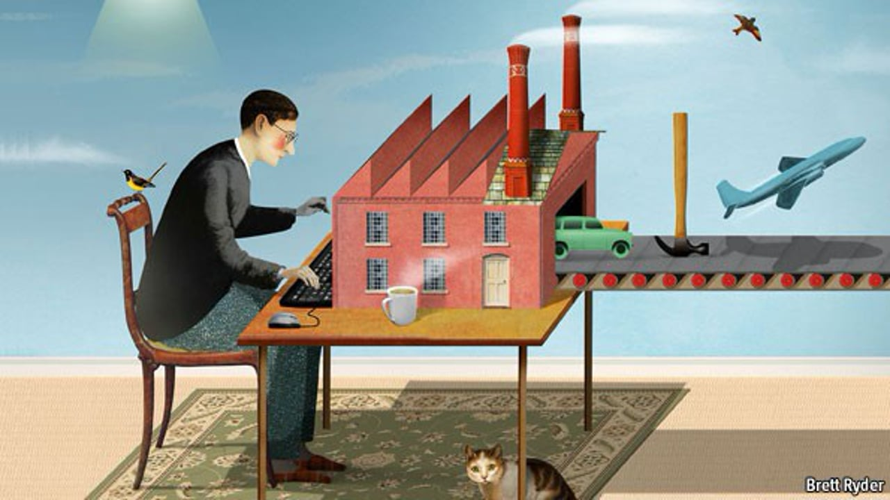

# Незаметная революция

Александр Мещеряков

Санкт-Петербург, 2021

alexvmesh@gmail.com

Версия: 0.1

## Содержание

- [Введение](#введение)
- [Уроки истории](#уроки-истории)
- [Экономика должна быть экономной](#экономика-должна-быть-экономной)
- [Труд с человеческим лицом](#труд-с-человеческим-лицом)

## Введение 

Мы живем в переломный момент истории - в период самой настоящей революции. Конечно, многие в той или иной мере это понимают: смартфоны, интернет, тотальная IT-фикация всего и вся - нельзя сказать, что эти явления остаются незамеченными. Но дело в том, что это только начальные проявления куда более мощных тектонических сдвигов, которые преобразуют экономику, а вслед за ней и все остальные сферы современного общества. То есть, мало кто замечает, что современная *техническая* революция порождает определенную революцию в *способе производства*, которая в свою очередь ведет к *социальной* революции. И этот процесс уже идет.

*Будущее производство по версии издания The Economist*

## Уроки истории

Не всегда даже самые светлые умы современности могут правильно оценить последствия событий, свидетелями которых они являются. Еще во второй половине XVIII века, в период набирающей силу промышленной революции, впоследствии определившей радикальные изменения в способе производства на века вперед, физиократы видели в промышленниках и наемных рабочих в промышленности лишь "бесплодный класс": они не были заняты в сельском хозяйстве, то есть не производили еду и сырье, которые сами потребляли. По мнению физиократов производительную силу имеет только земля, поэтому любое общество должно стремиться к созданию изобилия "произведений земли" силами занятых в сельском хозяйстве людей, а остальное не так важно.

Ситуацию также запутывало то обстоятельство, что в мануфактуре, которая впоследствии трансформировалась в фабрику, многие рабочие не могли полностью себя содержать без того, чтобы дополнительно не работать на подсобном земельном участке. Одна только занятость в мануфактуре при том уровне развития экономики просто не могла гарантировать рабочему выживание.

Но дальнейший ход развития промышленности окончательно оторвал рабочего от земли. Со временем промышленность охватила все важнейшие сферы производства, она проникла и в сельское хозяйство, преобразовав его по своему типу.

Какие уроки мы можем извлечь из этой истории, которые помогут нам разобраться в настоящем и спргнозировать будущее? Не вдаваясь в дискуссию, тезисно приведу основные выводы:

1. Социальную революцию "запускает" революция в технике и технологии производства: переворот в способе производства прежде всего меняет экономику, что в дальнейшем приводит к перевороту во всех остальных сферах жизни общества.

2. Новый способ производства вырастает из старого, основывается на старом и неизбежно им дополняется. Далее, развиваясь, он проникает в свое старое основание и преобразует его на новый лад - с этого момента новый способ производства встает на свою собственную основу и становится самостоятельным.

Учет этих положений избавляет от излишнего скепсиса и направляет внимание в сторону поиска действительно прогрессивных тенденций, несущих революционный потенциал. Становится не важно, что новые технологии пока слабо отражаются на нашем быте, а важно, какие принципиально новые производственные возможности они открывают. Не важно, что новый способ производства пока еще строится поверх старого, важно насколько уверенно и быстро он развивается. Без такого "компаса" мы оказываемся неспособны определить прогрессивные направления и действительно революционные процессы остаются долгое время незамеченными.

## Экономика должна быть экономной

Но что именно должна экономить экономика? Основная функция экономики - это создание благ, требуемых обществу для жизни и развития. Для успешного выполнения этой функции требуется достаточное количество ресурсов, которых всегда нехватает. То есть, чем больше и быстрее можно произвести требуемых благ при данном количестве ресурсов, тем лучше. Или, если мы сведем все требуемые ресурсы к их стоимостным выражениям, можно сказать, что экономика стремится к снижению стоимости производства благ, при прочих равных. Экономить при этом она будет человеческий труд, ибо любая стоимость в конечном итоге определяется затратами труда.

Противники трудовой теории стоимости в этом месте могут возразить, но давайте оставим полемику по этому вопросу за рамками текста данной статьи (можно будет обсудить в комментариях). Все-таки эта статья - не обзор всех возможных моделей реальности, а рассказ об одной конкретной модели и тех выводах, к которым она приводит.

Нас окружает потенциально бесконечная Вселенная с потенциально бесконечными возможностями. А раз так, то любой дефицитный ресурс потенциально может быть добыт (найден или произведен) в требуемом количестве, вопрос только в трудозатратах. Но может быть можно затратить меньше труда на изобретение новых орудий и процессов, применение которых позволит экономить имеющиеся ресурсы?

Так и есть, новая техника и технологии позволяют *оптимизировать структуру экономики*, прежде всего - *сферу производства*. И если господствующей тенденцией становится стремление экономить, а мы полагаем, что в исторической перспективе эта тенденция действительно господствует, то данным средствам дается ход.

## Труд с человеческим лицом

Появление машин и крупной промышленности высвободило огромное количество труда, и этот труд, снова вооруженный машинами, привел к появлению доселе невиданных благ, как по качеству, так и по количеству. Но по отношению к самому человеческому труду, индустриализация имела двоякие последствия.

Прежде, чем мы рассмотрим эти последствия, нужно определиться с тем, какой именно труд считать исконно человеческим. В определенном смысле "трудятся" и животные, но что отличает именно человека, так это то, что прежде, чем действовать, человек сначала активно строит идеальную модель своих действий в своей голове. Эта модель оценивается и корректируется как до начала действия, так и в процессе работы, подчиняясь задачи достижения некоторой сознательной цели, которая известна человеку заранее.

Так вот, применение машин раскололо занятых в производстве людей на две большие группы: меньшую группу составили те люди, которые заняли место "над машинами" и подчинили машины своей творческой воле; большую же группу составили те люди, что оказались "под машинами" - и тут уже их волю подчинила себе машина и способ ее работы. Огромные массы людей оказались в буквальном смысле придатками машин: они были поставлены выполнять однообразные частичные операции, работая в ритме машины, то есть осуществлять механические функции, практически лишенные творчества, до которых не успела добраться автоматизация. Это в значительной степени способствовало обесчеловечиванию труда.

И не только в промышленности: индустриальные производственные отношения оказали влияние на многие другие сферы общества, например, система образования и функционирование чиновничьего *аппарата* уподобились фабрике.

